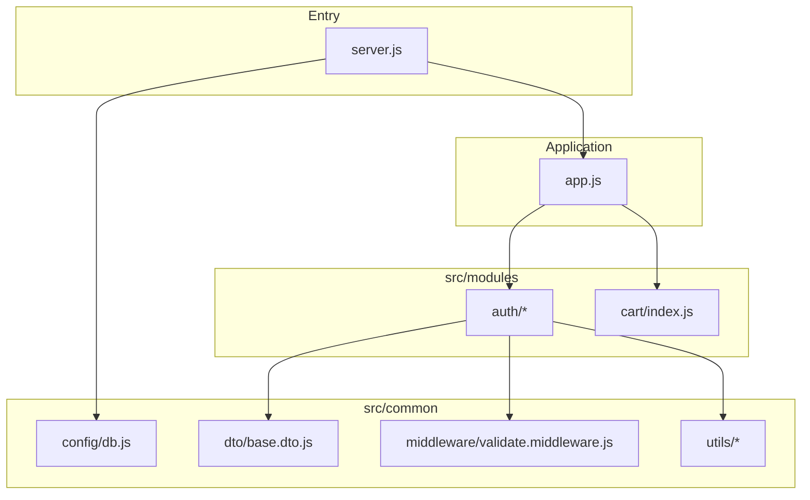

# Repository structure

This document describes the layout of the **chai-cohort backend** (Express + MongoDB).

## Directory tree

```text
backend/
├── .env                    # local secrets (gitignored; use .env.example as template)
├── .env.example
├── .gitignore
├── package.json
├── package-lock.json
├── README.md
├── server.js                 # process entry: loads env, connects DB, starts HTTP server
└── src/
    ├── app.js                # Express app instance
    ├── common/
    │   ├── config/
    │   │   └── db.js         # MongoDB connection
    │   ├── dto/
    │   │   └── base.dto.js   # shared Joi DTO base class
    │   ├── middleware/
    │   │   └── validate.middleware.js
    │   └── utils/
    │       ├── api-error.js
    │       ├── api-response.js
    │       └── jwt.utils.js
    └── modules/
        ├── auth/
        │   ├── dto/
        │   │   └── register.dto.js
        │   ├── auth.controller.js
        │   ├── auth.middleware.js
        │   ├── auth.model.js
        │   ├── auth.routes.js
        │   └── auth.service.js
        └── cart/
            └── index.js
```

> **Note:** `node_modules/` is installed dependency output and is not listed here.

## High-level flow



## Folder roles

| Path                | Role                                                                                          |
| ------------------- | --------------------------------------------------------------------------------------------- |
| `server.js`         | Bootstrap: `dotenv`, DB connect, `listen` on `PORT`.                                          |
| `src/app.js`        | Creates the Express `app` (middleware and route mounting are expected here as the app grows). |
| `src/common/`       | Cross-cutting code: DB, DTO base, validation middleware, API helpers, JWT helpers.            |
| `src/modules/auth/` | Auth feature: routes, controller, service, Mongoose model, DTOs, auth-specific middleware.    |
| `src/modules/cart/` | Cart feature (currently a placeholder module).                                                |

## Conventions (intended)

- **Feature modules** live under `src/modules/<name>/`.
- **Shared primitives** live under `src/common/`.
- **ES modules** are used (`"type": "module"` in `package.json`); prefer explicit `.js` extensions in import paths for consistency across Node ESM resolution.
