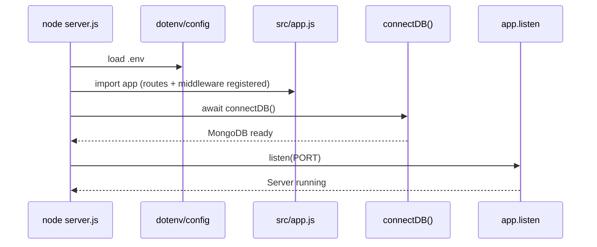
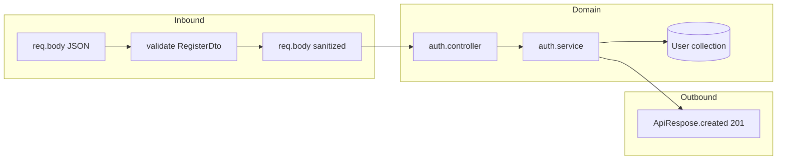

# Application workflow

This document describes how the backend boots and how a typical HTTP request flows through the layers. It matches the current layout under `server.js`, `src/app.js`, `src/common/`, and `src/modules/`.

---

## 1. Boot sequence (process startup)

When you run `node server.js` (or `npm start`):

1. **`dotenv/config`** loads environment variables from `.env` (e.g. `PORT`, `MONGO_URI`, `NODE_ENV`).
2. **`src/app.js`** is evaluated: the Express `app` is created, global middleware is registered, and routes are mounted (see §2).
3. **`connectDB()`** (`src/common/config/db.js`) runs and **`mongoose.connect(process.env.MONGO_URI)`** establishes the MongoDB connection.
4. **`app.listen(PORT)`** starts the HTTP server (default port **5000** if `PORT` is unset).
5. If any step throws (e.g. invalid `MONGO_URI`), **`server.js`** logs and **`process.exit(1)`**.



---

## 2. Express app wiring (`src/app.js`)

Order matters: middleware and routers are applied top to bottom.

| Order | What runs | Purpose |
| ----- | --------- | ------- |
| 1 | `express.json()` | Parse JSON request bodies into `req.body`. |
| 2 | `app.use("/api/auth", authRouter)` | All auth routes are under the **`/api/auth`** prefix. |
| 3 | Error-handling middleware (4 args) | Catches errors passed via `next(err)` (including `ApiError`) and responds with JSON `{ success, message }` and the appropriate HTTP status. |

Anything that does not match a route is not handled by a dedicated 404 handler yet; unhandled routes fall through until the error handler only sees errors explicitly forwarded with `next(err)`.

---

## 3. Request workflow (example: user registration)

**Endpoint:** `POST /api/auth/register`  
**Content-Type:** `application/json`

### 3.1 High-level path

```text
Client
  → express.json()          (parse body)
  → /api/auth + auth router
  → validate(RegisterDto)   (Joi via BaseDto)
  → auth.controller.register
  → auth.service.register
  → User model (Mongoose)
  → ApiRespose.created      (201 + JSON)
```

### 3.2 Step-by-step

1. **JSON parsing** — `express.json()` fills `req.body` with the parsed object (or leaves it empty if invalid JSON; Express may respond with 400 before your route runs).

2. **Route match** — `POST /register` on the auth router, mounted at `/api/auth`, resolves to **`POST /api/auth/register`**.

3. **Validation** — `validate(RegisterDto)` runs:
   - **`RegisterDto`** extends **`BaseDto`** and defines a static Joi **`schema`**.
   - **`BaseDto.validate(req.body)`** runs Joi with `abortEarly: false` and `stripUnknown: true`.
   - On validation failure: **`next(ApiError.badRequest(...))`** → error middleware → **400** JSON.
   - On success: **`req.body`** is replaced with the sanitized **`value`**, then **`next()`**.

4. **Controller** — **`auth.controller.register`** calls **`auth.service.register(req.body)`**.

5. **Service** — **`auth.service.register`**:
   - Checks for an existing user by email; if found, **`throw ApiError.conflict(...)`** → **409** (via error middleware).
   - Generates verification tokens via **`jwt.utils`** (`generateResetToken`).
   - **`User.create(...)`** persists the document (Mongoose **`auth.model`**).
   - Returns a plain object without **`password`** for the response.

6. **Response** — **`ApiRespose.created(res, message, user)`** sends **201** with `{ success, message, data }`.



---

## 4. Error workflow

| Source | Typical mechanism | HTTP result |
| ------ | ----------------- | ----------- |
| Joi validation | `next(ApiError.badRequest(message))` | **400** |
| Duplicate email | `throw ApiError.conflict(...)` in service | **409** |
| Other thrown `ApiError` | `err.statusCode` on the error instance | As set on the error |
| Uncaught errors / missing `statusCode` | Error middleware default | **500** |

The error middleware in **`app.js`** always responds with JSON:

```json
{ "success": false, "message": "..." }
```

---

## 5. Module boundaries (mental model)

| Layer | Location | Responsibility |
| ----- | -------- | -------------- |
| **Entry** | `server.js` | Env, DB connect, start listening. |
| **HTTP shell** | `src/app.js` | Global middleware, mount feature routers, global error JSON. |
| **Routes** | `src/modules/<feature>/*.routes.js` | Path + HTTP method → middleware chain → controller. |
| **Validation** | `common/middleware/validate.middleware.js` + `common/dto/` + feature `dto/` | Input shape and rules; normalize `req.body`. |
| **Controller** | `*.controller.js` | Call services; map results to HTTP helpers (`ApiRespose`). |
| **Service** | `*.service.js` | Business rules, orchestration, calls to models and utilities. |
| **Model** | `*.model.js` | Mongoose schema and persistence. |
| **Shared utils** | `src/common/utils/` | Cross-cutting helpers (`ApiError`, JWT helpers, etc.). |

---

## 6. Environment variables (runtime)

| Variable | Role |
| -------- | ---- |
| `MONGO_URI` | MongoDB connection string for `mongoose.connect`. |
| `PORT` | HTTP listen port (defaults to **5000** in `server.js` if unset). |
| `NODE_ENV` | Logged at startup; use for future behavior (e.g. verbose errors only in development). |

Keep secrets in **`.env`** (ignored by git); use **`.env.example`** as a template for required keys without real values.
